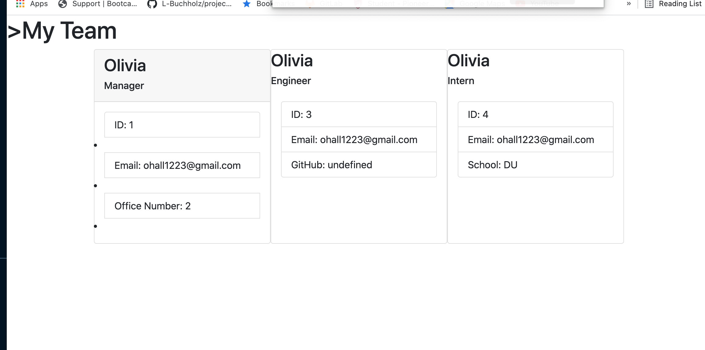

# Team-Profile-Generator

## Discription

-Web application that allows the user to build team profile cards that will display on a webpage. The team cards wil display the teammates name, id #, email, and role. For the managers the card will display the office #. For the engineers the card will display the teammates GitHub username and a link. For the interns the card will display teh intern's school.

## Installation

-The user will need to install inquirer to run the server side questions, and jest to run the tests.

## Usage

- This page is for buildig a team profile page.

Video walkthrough of tests passing and HTML folder being built using the app: https://watch.screencastify.com/v/fvVFwHZuwhZ0XslmKui6



## Credits

-Olivia Hall built the javascript functions, the HTML and the tests.

## License

-MIT License

Copyright (c) [2021] [Olivia Hall]

Permission is hereby granted, free of charge, to any person obtaining a copy
of this software and associated documentation files (the "Software"), to deal
in the Software without restriction, including without limitation the rights
to use, copy, modify, merge, publish, distribute, sublicense, and/or sell
copies of the Software, and to permit persons to whom the Software is
furnished to do so, subject to the following conditions:

The above copyright notice and this permission notice shall be included in all
copies or substantial portions of the Software.

THE SOFTWARE IS PROVIDED "AS IS", WITHOUT WARRANTY OF ANY KIND, EXPRESS OR
IMPLIED, INCLUDING BUT NOT LIMITED TO THE WARRANTIES OF MERCHANTABILITY,
FITNESS FOR A PARTICULAR PURPOSE AND NONINFRINGEMENT. IN NO EVENT SHALL THE
AUTHORS OR COPYRIGHT HOLDERS BE LIABLE FOR ANY CLAIM, DAMAGES OR OTHER
LIABILITY, WHETHER IN AN ACTION OF CONTRACT, TORT OR OTHERWISE, ARISING FROM,
OUT OF OR IN CONNECTION WITH THE SOFTWARE OR THE USE OR OTHER DEALINGS IN THE
SOFTWARE.

```

```

## Badges

[](https://opensource.org/licenses/MIT)
